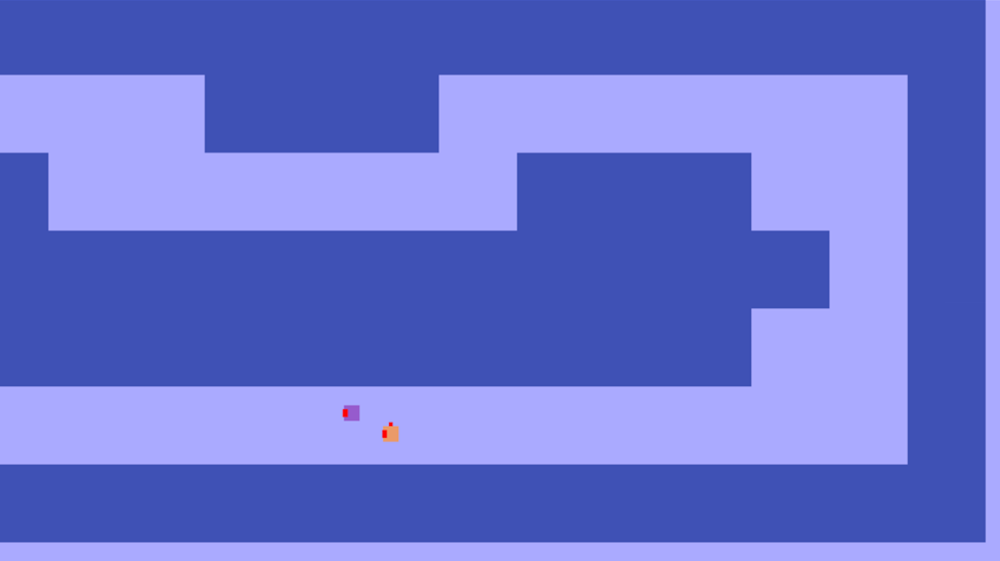

ag-drift
========

A multiplayer anti-gravity racing game. [Play it on Heroku!](http://ag-drift.herokuapp.com/)

## Controlls

- <kbd>&uarr;</kbd> - Throttle/Move forward
- <kbd>&rarr;</kbd> - Turn 90º right.
- <kbd>&larr;</kbd> - Turn 90º left.
- <kbd>A</kbd> - Lean right.
- <kbd>D</kbd> - Lean left.
- <kbd>S</kbd> - Speed boost.

## License

MIT © [David da Silva]

[David da Silva]: https://dasilvacont.in
